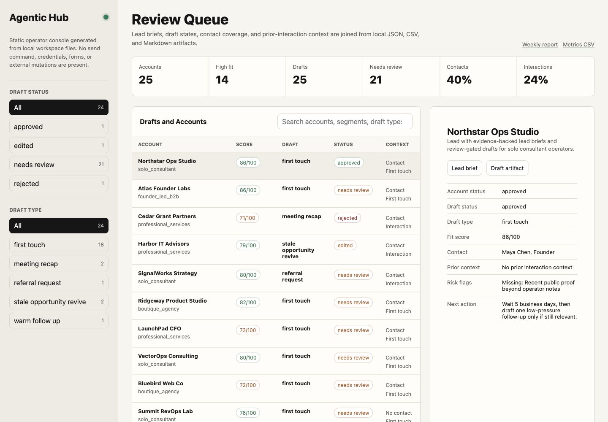

# Agentic Hub

Agentic Hub is a personal lead-gen, outreach, wiki, and analytics system built as reusable Codex workflow packs.

It is designed as both a portfolio project and a productizable operating system for high-trust revenue workflows: lead research, human-approved follow-ups, and pipeline analytics.

The product is intentionally not an autonomous spam tool. It is a supervised operating layer that helps a solo operator or small team find better prospects, prepare better context, draft better follow-ups, and measure what is working without handing outbound judgment to an agent.

## Product Thesis

Small teams do not need another CRM. They need a workflow layer that turns scattered inputs into reviewed actions:

- who to contact
- why they are a fit
- what evidence supports that fit
- what follow-up should be drafted
- what needs human approval
- what changed after outreach
- which workflow produced pipeline

Agentic Hub packages these jobs as reusable Codex skills and workflow packs that can run locally, connect to existing tools, and emit auditable artifacts.

## Initial Packs

1. `lead-gen`
   - Research target accounts and contacts from approved sources.
   - Score fit using explicit criteria.
   - Produce evidence-backed lead briefs.

2. `follow-ups`
   - Turn meeting notes, CRM state, inbox context, and previous outreach into human-approved follow-up drafts.
   - Track next actions and stale conversations.

3. `analytics`
   - Measure workflow performance: researched leads, approved drafts, sent follow-ups, replies, meetings, conversion, and cycle time.
   - Produce weekly operating reports.

## Repository Map

- `bin/agentic-hub.mjs` - zero-dependency local CLI for the first MVP workflow.
- `schemas/` - JSON schemas for accounts, contacts, previous interactions, evidence, drafts, events, and manual outcomes.
- `examples/sample-workspace/` - runnable fixture workspace with generated sample outputs.
- `docs/product-plan.md` - product strategy, positioning, packaging, monetization.
- `docs/prd.md` - product requirements document for the first shippable version.
- `docs/workflow-pack-architecture.md` - workflow-pack design, inputs, outputs, guardrails.
- `docs/demo-walkthrough.md` - 3-5 minute reviewer path through the generated proof artifacts.
- `docs/case-study-fixture-sprint.md` - sanitized case study for the runnable fixture sprint.
- `docs/permissioned-pilot-runbook.md` - safe operating path for a real client sprint.
- `docs/service-offer.md` - service offer and pricing page draft for the pipeline sprint.
- `docs/roadmap.md` - 48-hour, 30-day, and 90-day implementation path.
- `docs/go-to-market.md` - first customer, service wedge, pricing, and proof strategy.
- `packs/` - pack-level specs for lead gen, follow-ups, and analytics.
- `templates/workflow-pack-template.md` - reusable template for future packs.
- `templates/pipeline-sprint-intake.md` - intake checklist for a permissioned sprint.
- `templates/before-after-proof.md` - sanitized proof template for a real before/after case study.
- `research/source-notes.md` - research signals and operating assumptions.
- `AGENTS.md` - repo instructions for future Codex agents.

## Operating Principles

- Human approval before sending messages, submitting forms, purchasing, scraping sensitive systems, or mutating external records.
- Evidence over vibes: every lead score and recommendation should cite source evidence.
- Deterministic first: use APIs, structured data, and explicit rules before browser automation.
- Browser/computer use only when no reliable API exists.
- The system should produce artifacts a client can inspect: CSVs, briefs, reports, screenshots, logs, and GitHub issues.

## Local MVP Quickstart

The first runnable slice is a local, inspectable CLI. It uses Node.js built-ins only: no database, no credentials, no browser automation, no outbound sending.

### Portfolio Review Path

For a fast GitHub review, open these in order:

1. `examples/sample-workspace/outputs/screenshots/operator-console.jpg` - see the review queue, metrics, filters, and no-send boundary at a glance.
2. `examples/sample-workspace/outputs/console/index.html` - inspect the local operator console and jump to reports, evals, handoff, and sanitized proof artifacts.
3. `examples/sample-workspace/outputs/reports/weekly-pipeline-report.md` - read the operating summary, draft mix, bottlenecks, and manual outcome denominator.
4. `examples/sample-workspace/outputs/evals/quality-report.md` - see deterministic readiness checks for evidence coverage, review status, and guardrails.
5. `examples/sample-workspace/outputs/handoff/README.md` - inspect the client-safe delivery bundle.
6. `examples/sample-workspace/outputs/sanitized/README.md` - inspect the publishable proof bundle with names and raw internals removed.
7. `docs/demo-walkthrough.md` - follow the full 3-5 minute proof path.

### Inspect In Two Minutes

1. Run `npm run fixture`.
2. Open `examples/sample-workspace/outputs/console/index.html`.
3. Follow `docs/demo-walkthrough.md` to inspect the queue, filters, lead briefs, draft artifacts, weekly report, state files, and run logs.



Run the fixture workflow:

```sh
npm run fixture
```

Validate the generated workspace:

```sh
npm run check
```

Run against a new local workspace:

```sh
node ./bin/agentic-hub.mjs init --workspace ./workspace
node ./bin/agentic-hub.mjs run --workspace ./workspace
node ./bin/agentic-hub.mjs review-account --workspace ./workspace --account acct_example_consulting_co --status approved --note "Human reviewed."
node ./bin/agentic-hub.mjs review-draft --workspace ./workspace --draft draft_example_consulting_co_first_touch --status edited --note "Needs a stronger proof point."
node ./bin/agentic-hub.mjs revise-draft --workspace ./workspace --draft draft_example_consulting_co_first_touch --changes "Add a stronger proof point before approval."
node ./bin/agentic-hub.mjs review-draft --workspace ./workspace --draft draft_example_consulting_co_first_touch_rev1 --status approved --note "Human approved revised draft."
node ./bin/agentic-hub.mjs record-outcome --workspace ./workspace --draft draft_example_consulting_co_first_touch_rev1 --status replied --sent-at 2026-06-12 --reply-at 2026-06-13 --note "Recorded manually after operator-controlled outreach."
node ./bin/agentic-hub.mjs evaluate --workspace ./workspace
node ./bin/agentic-hub.mjs report --workspace ./workspace
node ./bin/agentic-hub.mjs console --workspace ./workspace
node ./bin/agentic-hub.mjs export --workspace ./workspace
node ./bin/agentic-hub.mjs sanitize --workspace ./workspace
```

The fixture writes:

- `examples/sample-workspace/outputs/lead-briefs/` - evidence-backed account briefs.
- `examples/sample-workspace/outputs/drafts/` - follow-up drafts that start in `needs_review`.
- `examples/sample-workspace/outputs/reports/weekly-pipeline-report.md` - analytics report.
- `examples/sample-workspace/outputs/evals/quality-report.md` - deterministic quality/readiness evaluation for briefs and drafts.
- `examples/sample-workspace/outputs/evals/quality-scores.csv` - eval scores in CSV form.
- `examples/sample-workspace/outputs/console/index.html` - static local operator console for review queue inspection.
- `examples/sample-workspace/outputs/screenshots/operator-console.jpg` - rendered console screenshot for GitHub review.
- `examples/sample-workspace/outputs/handoff/` - client-safe handoff bundle that excludes raw inputs, state, and logs by default.
- `examples/sample-workspace/outputs/sanitized/` - publishable proof bundle with account/contact names redacted and raw internals excluded.
- `examples/sample-workspace/inputs/contacts.csv` - local operator-provided buyer/contact context.
- `examples/sample-workspace/inputs/research.csv` - manually captured approved-source research evidence.
- `examples/sample-workspace/inputs/previous_interactions.md` - local operator-provided prior interaction context for warm follow-ups, recaps, revives, and referrals.
- `examples/sample-workspace/inputs/outcomes.csv` - manually recorded outcomes after operator-controlled activity outside Agentic Hub.
- `examples/sample-workspace/state/` - inspectable JSON/JSONL state.
- `examples/sample-workspace/logs/runs.jsonl` - audit log for pack runs.

### Example Output

The sample sprint imports 25 fictional accounts, loads 10 local contact records, 10 manually captured research evidence rows, and 6 prior interaction notes, generates 25 lead briefs, creates 24 initial review-gated drafts plus one revised draft, skips one disqualified automation-risk account, records manual review decisions, records one manual outcome, and produces a deterministic quality eval, weekly report, and static operator console with draft type mix. The MVP deliberately does not include any send command or external side effect.

Read the guided proof path in `docs/demo-walkthrough.md` and the sanitized proof narrative in `docs/case-study-fixture-sprint.md`.

For a real pilot, use `docs/permissioned-pilot-runbook.md`, `templates/pipeline-sprint-intake.md`, and `templates/before-after-proof.md`.

Start a private permissioned pilot workspace with:

```sh
node ./bin/agentic-hub.mjs pilot-init --workspace ../client-sprint-workspace
```

That command creates starter inputs plus `PILOT-CHECKLIST.md`, `config/publication-approval.md`, and a workspace `.gitignore` that keeps raw client inputs, state, logs, and outputs out of Git by default.

Implementation stack: Node.js ESM with plain files. This keeps the workflow easy to run now and leaves a clean path toward a TypeScript web console later.

## First Milestone

Build a local proof that can run on a curated list of 25 target companies:

1. Ingest a CSV of target accounts.
2. Research each account from approved public sources.
3. Produce a lead brief with evidence, fit score, and suggested angle.
4. Draft a follow-up sequence that requires human approval.
5. Generate an analytics report showing workflow throughput and quality.
